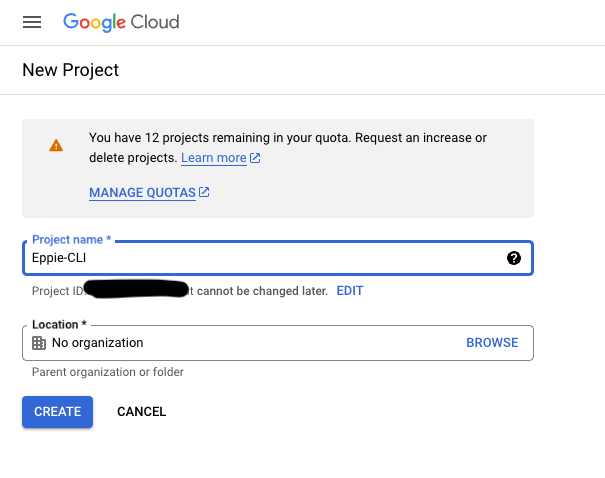

# Register the application

## Gmail API Registration

The screens may look different depending on the order of your actions and whether you've worked with Google Console previously, but the simplest flow is as follows:

1. Go to https://console.cloud.google.com/ and hit **Create or select a project**.

Give it a name, skip the organisation field.

2. Now we need to configure OAuth Consent Screen. With the project selected go to **APIs & Services > OAuth consent screen** on the sidebar.

Choose **External** user type.

Fill in the app name and contact information.

3. Next is an important step of selecting what type of data the application is allowed to access. At the following screen select **Add or remove scopes**.

You may select appropriate scopes from the list, or just type in manually **"https://mail.google.com"**, **"email"**, and **"profile"**, separated by commas.

4. This is not strictly necessary but you may want to add your email address as a test user. Then you can leave the app in testing mode (no actions required) but Eppie will only be able to authenticate with the test user account. 

If you skip the above step, then you will need to switch to production mode. Go to **APIs & Services > OAuth consent screen** again and **Publish app**.

Later whenever you are authenticating with Eppie-CLI at you Gmail account, you will get a warning from Google that the application has not been verified. Despite the warning you will be able to continue with the authentication by chosing **Advanced** dropdown.

5. Lastly, create the application credentials. Go to **APIs & Services > Credentials > Create credentials > OAuth Client ID**.

And you are done. Pass the **Client ID** and **Client secret** as arguments when launchig Eppie-CLI from the console as described [here](../README.md#launch).

## Microsoft Outlook API Registration

WIP

## See Also

- Google:
  - [OAuth 2.0 for Mobile & Desktop Apps](https://developers.google.com/identity/protocols/oauth2/native-app)
  - [Using OAuth 2.0 to Access Google APIs](https://developers.google.com/identity/protocols/oauth2)
- Outlook:
  - [Authenticate an IMAP, POP or SMTP connection using OAuth](https://learn.microsoft.com/en-us/exchange/client-developer/legacy-protocols/how-to-authenticate-an-imap-pop-smtp-application-by-using-oauth)
  - [Register an application with the Microsoft identity platform](https://learn.microsoft.com/en-us/azure/active-directory/develop/quickstart-register-app)
  - [Compare Microsoft Graph and Outlook REST API endpoints](https://learn.microsoft.com/en-us/outlook/rest/compare-graph)
  - [OAuth 2.0 authorization code flow](https://learn.microsoft.com/en-us/azure/active-directory/develop/v2-oauth2-auth-code-flow)
